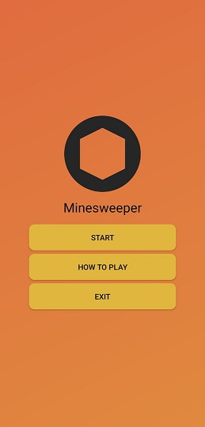
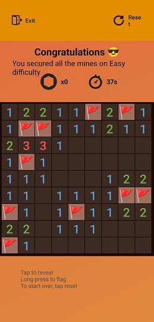

# **💣 Minesweeper Mobile Game 📱**

A classic Minesweeper game developed as a mobile application development project. This project implements the core logic of the game, including random mine placement, recursive tile revealing, and victory/defeat condition handling, suitable for modern mobile platforms.

## **✨ Features**

* **Difficulty Levels:** Supports multiple game modes (e.g., Easy and Intermediate).
* **First Click Safety:** Guarantees that the very first tile clicked is never a mine, ensuring a smooth start to every game.
* **Solvability Guarantee:** The game board generation algorithm ensures that every game is logically solvable without requiring lucky guesses.
* **Tile Interaction:** Allows for safe tile revealing and marking potential mine locations with flags.
* **Real-time Tracking:** Includes a Time Tracker and a Mine Counter for dynamic gameplay status.
* **Game States:** Clearly handles initial setup, active gameplay, and distinct Victory and Game Over screens.

## **🛠️ Technology Stack**

This project was developed for a mobile application context.

* **Language:** Java
* **Framework/Platform:** Android Native (using Android Studio Meerkat)

## **🚀 Getting Started**

### **Prerequisites**

* **Android Studio (Meerkat version or later):** The integrated development environment.
* **Android SDK:** Required for building and running the application.

### **Installation**

1. **Clone the repository:**
   * ```git clone https://github.com/Zigatronz/Minesweeper```

2. **Open in Android Studio:**
   * Launch Android Studio.
   * Select `File` \> `Open` and navigate to the cloned project directory.
   * Allow Gradle to synchronize and download necessary dependencies.

3. **Run the application:**
   * Ensure an Android Emulator is running or a physical device is connected.
   * Click the **Run** button in Android Studio to deploy the app.

## **🖼️ Screenshots**




*This project was completed for the **Mobile Application Development (DCS3241)** course at the International Islamic College (IIC, a subsidiary of UIA).*